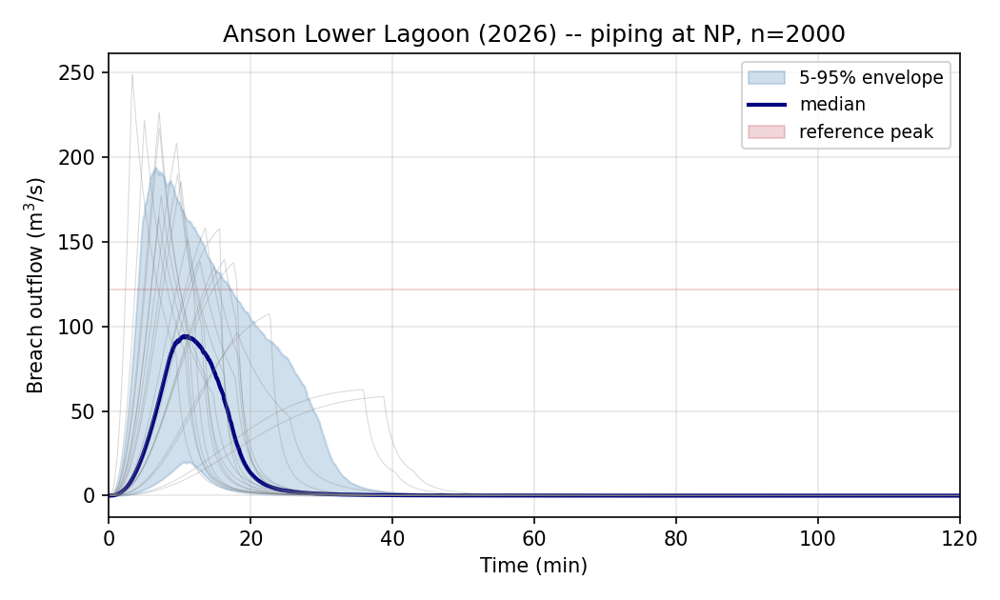

# Anson County WTP Lower Lagoon (2026)

This tutorial reproduces a real PE engagement: a piping breach analysis
of the Anson County Water Treatment Plant Lower Lagoon (NC state ID
ANSON-057), prepared for a Class C → Class A hazard reclassification
submittal to the North Carolina Dam Safety Program in April 2026.

The submittal and underlying as-built survey are public records under
N.C. Gen. Stat. § 132-1.

## Embankment parameters

| Parameter | Value |
|---|---:|
| Structural height | 25.0 ft (7.62 m) |
| Crest elevation | 463.5 ft NAVD88 |
| Normal pool elevation | 458.89 ft NAVD88 |
| Volume at NP | 64.0 ac-ft (78,940 m³) |
| Volume at crest | 111 ac-ft (~137,000 m³) |
| Failure mode | Piping |
| Embankment type | HDPE-lined earthen, 2015-2018 rehab |

## Reference

A 2D unsteady-flow HEC-RAS 6.6 analysis prepared for the
reclassification submittal reported a peak breach outflow of **4,301
cfs (121.8 m³/s)** for the Lower-piping-at-NP scenario.

## Reproducing the result

```python
import numpy as np
from swmm_breach import FailureMode, StorageCurve
from swmm_breach.uncertainty import ensemble_simulate_multi_model

NP_ELEV_M     = 458.89 * 0.3048
CREST_ELEV_M  = 463.5 * 0.3048
TOE_ELEV_M    = CREST_ELEV_M - 25.0 * 0.3048
VOL_NP_M3     = 64.0 * 1233.48
VOL_CREST_M3  = 111.0 * 1233.48

storage = StorageCurve(
    stage_m=np.array([TOE_ELEV_M, 136.5, NP_ELEV_M, CREST_ELEV_M]),
    volume_m3=np.array([0.0, 10_000.0, VOL_NP_M3, VOL_CREST_M3]),
)

ens = ensemble_simulate_multi_model(
    storage=storage,
    crest_elevation_m=NP_ELEV_M,
    initial_stage_m=NP_ELEV_M,
    volume_m3=VOL_NP_M3,
    height_m=NP_ELEV_M - TOE_ELEV_M,
    mode=FailureMode.PIPING,
    n_samples=2000,
    dt_s=2.0,
    duration_s=2 * 3600,
    rng=np.random.default_rng(20260511),
)

print(f"Peak Q 5/50/95: "
      f"{ens.peak_percentile(5):.1f} / "
      f"{ens.peak_percentile(50):.1f} / "
      f"{ens.peak_percentile(95):.1f} m^3/s")
```

Output:

```
Peak Q 5/50/95: 82.2 / 148.0 / 235.1 m^3/s
```

## Result



| Quantity | Value | vs HEC-RAS |
|---|---:|---:|
| HEC-RAS 6.6 2D reference | 121.8 m³/s | — |
| Ensemble 5th percentile | 82 m³/s | 67% of ref |
| Ensemble median | 148 m³/s | 121% of ref |
| Ensemble 95th percentile | 235 m³/s | 193% of ref |

The HEC-RAS reference lies within the 5-95 envelope, and the ensemble
median is within a factor of 1.21 of HEC-RAS — well inside the
factor-of-two tolerance commonly used for breach-model agreement.

## Why agreement is close at lagoon scale

The Lower Lagoon is small enough that level-pool dynamics dominate over
headcut migration, side slopes don't evolve dramatically over the
breach formation time, and the broad-crested-weir representation of the
developing breach is a defensible engineering approximation. Compare
with the [Teton tutorial](teton.md), where these assumptions break down
and the deterministic point estimate misses observed by ~80%.

## Source

- Runnable script: [`examples/anson_lower_lagoon.py`](https://github.com/mf4633/swmm-breach/blob/main/examples/anson_lower_lagoon.py)
- Regression test: [`tests/test_anson_case.py`](https://github.com/mf4633/swmm-breach/blob/main/tests/test_anson_case.py)
