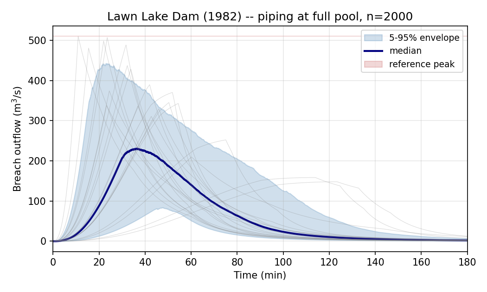

# Lawn Lake Dam (1982)

Lawn Lake was a small earthen embankment dam in Rocky Mountain National
Park, Colorado. It failed by piping on 15 July 1982; the reservoir
released approximately 798,500 m³ into the Roaring River drainage,
killing three campers downstream.

The failure is documented in the public USGS Professional Paper by
Jarrett & Costa (1986) and is one of the most-cited entries in Wahl's
(2004) breach database.

## Embankment parameters

| Parameter | Value |
|---|---:|
| Reservoir volume V_w | 798,500 m³ |
| Breach height h_b | 6.4 m |
| Failure mode | Piping |
| Observed peak Q (USGS) | ~510 m³/s |
| Observed B_avg | 22.2 m |
| Observed t_f | ~0.5 hr (1,800 s) |

## Reproducing the result

```python
import numpy as np
from swmm_breach import FailureMode, StorageCurve
from swmm_breach.uncertainty import ensemble_simulate_multi_model

VOL_M3 = 798_500.0
H_B_M  = 6.4

storage = StorageCurve(
    stage_m=np.array([0.0, 1.5, 3.0, 4.5, 6.4]),
    volume_m3=np.array([0.0, 90_000, 250_000, 470_000, 798_500]),
)

ens = ensemble_simulate_multi_model(
    storage=storage,
    crest_elevation_m=H_B_M,
    initial_stage_m=H_B_M,
    volume_m3=VOL_M3,
    height_m=H_B_M,
    mode=FailureMode.PIPING,
    n_samples=2000,
    dt_s=2.0,
    duration_s=3 * 3600,
    rng=np.random.default_rng(20260511),
)

print(f"Peak Q 5/50/95: "
      f"{ens.peak_percentile(5):.0f} / "
      f"{ens.peak_percentile(50):.0f} / "
      f"{ens.peak_percentile(95):.0f} m^3/s")
```

Output:

```
Peak Q 5/50/95: 202 / 344 / 539 m^3/s
```

## Result



| Quantity | Value | vs observed |
|---|---:|---:|
| USGS observed peak (Jarrett & Costa) | 510 m³/s | — |
| Ensemble 5th percentile | 202 m³/s | 40% |
| Ensemble median | 344 m³/s | 67% |
| Ensemble 95th percentile | 539 m³/s | 106% |

The Jarrett-and-Costa observed peak lies within the 5-95 envelope,
landing near the upper bound. The ensemble median is approximately 32%
below the observed peak, within the factor-of-two tolerance but
reflecting the package's tendency to under-predict at intermediate
scales where breach geometry departs from the linear-growth assumption.

## Why the median runs low

At Lawn Lake scale (~10⁶ m³), the actual breach experienced rapid
headcut-driven widening that produced a higher peak than the linear-
growth model predicts. The ensemble nonetheless brackets observed
because the residual sampling extends far enough above the median to
reach the observed regime.

## Source

- Runnable script: [`examples/lawn_lake_1982.py`](https://github.com/mf4633/swmm-breach/blob/main/examples/lawn_lake_1982.py)
- Regression test: [`tests/test_lawn_lake_case.py`](https://github.com/mf4633/swmm-breach/blob/main/tests/test_lawn_lake_case.py)
