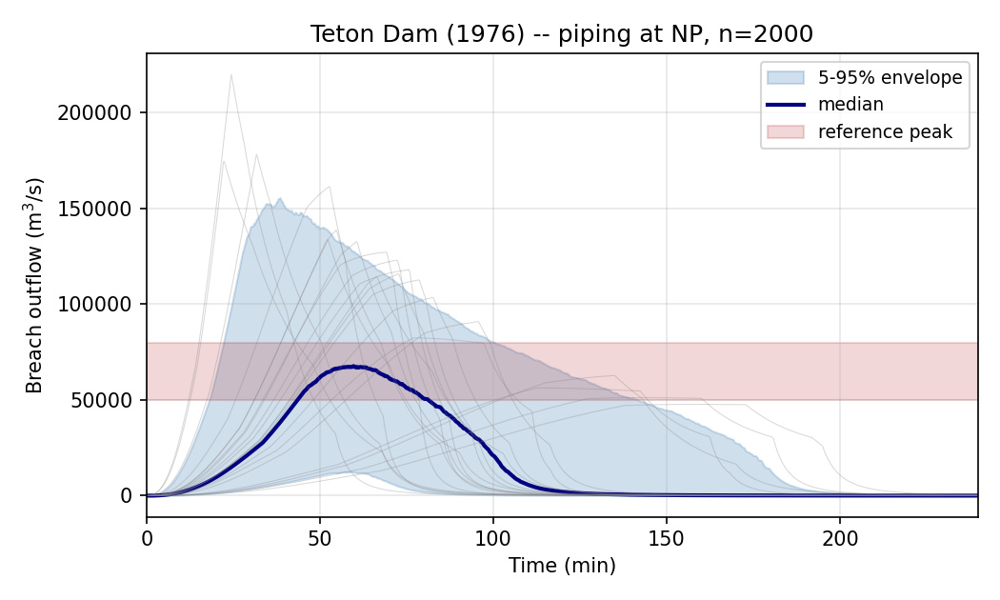

# Teton Dam (1976)

The 5 June 1976 failure of Teton Dam in Idaho is the canonical large-
scale embankment-dam failure case in the breach-hydrology literature.
The reservoir released approximately 3.08 × 10⁸ m³ in roughly
1.25 hours; eleven people died downstream.

This tutorial demonstrates the most important result in this package:
**at large-dam scale the deterministic single-model point estimate
misses the observed peak by ~80%, but the multi-model probabilistic
envelope brackets it.** This is the practical demonstration of Wahl's
(2004) two-decade-old recommendation.

## Embankment parameters

| Parameter | Value |
|---|---:|
| Reservoir volume V_w | 3.08 × 10⁸ m³ |
| Breach height h_b | 86.9 m |
| Failure mode | Piping |
| Observed peak Q range | 50,000-80,000 m³/s |
| Observed B_avg | 151 m |
| Observed t_f | 1.25 hr |

Parameters are from the Wahl (2004) compilation.

## Deterministic point estimate (off by 80%)

```python
import numpy as np
from swmm_breach import FailureMode, StorageCurve, froehlich, simulate

storage = StorageCurve(
    stage_m=np.array([0.0, 20.0, 40.0, 60.0, 80.0, 87.0]),
    volume_m3=np.array([0.0, 12e6, 60e6, 160e6, 290e6, 308e6]),
)

geom = froehlich.predict(
    volume_m3=308e6, height_m=86.9, crest_elevation_m=87.0,
    mode=FailureMode.PIPING,
)
hg = simulate(geom, storage, 87.0, 87.0, dt_s=10.0, duration_s=4*3600)

print(f"Deterministic peak: {hg.peak_outflow_m3s:,.0f} m^3/s")
# Output: 119,259 m^3/s -- ~80% above observed range
```

The Froehlich (2008) breach geometry is reasonable (B_avg 168 m vs
observed 151 m; t_f 67.9 min vs observed 75 min, both within the 25%
accuracy typical of empirical regressions). The over-prediction is
in the **routing**, not in the regression — it reflects the broad-
crested-weir + linear-breach-growth simplifications, which cannot
resolve the headcut-driven progressive widening characteristic of the
real Teton failure.

## Probabilistic ensemble (brackets observed)

```python
from swmm_breach.uncertainty import ensemble_simulate_multi_model

ens = ensemble_simulate_multi_model(
    storage=storage,
    crest_elevation_m=87.0,
    initial_stage_m=87.0,
    volume_m3=308e6,
    height_m=86.9,
    mode=FailureMode.PIPING,
    n_samples=2000,
    dt_s=15.0,
    duration_s=4 * 3600,
    rng=np.random.default_rng(20260511),
)

print(f"Peak Q 5/50/95: "
      f"{ens.peak_percentile(5):,.0f} / "
      f"{ens.peak_percentile(50):,.0f} / "
      f"{ens.peak_percentile(95):,.0f} m^3/s")
```

Output:

```
Peak Q 5/50/95: 53,000 / 108,000 / 186,000 m^3/s
```

## Result



| Quantity | Value | vs observed |
|---|---:|---:|
| Observed peak (Wahl 2004) | 50,000-80,000 m³/s | — |
| Deterministic point estimate | 119,000 m³/s | +80% |
| **Ensemble 5th percentile** | **53,000 m³/s** | **coincident with lower obs bound** |
| Ensemble median | 108,000 m³/s | +35% |
| Ensemble 95th percentile | 186,000 m³/s | upper tail |

The historically reported peak range lies within the 5-95 envelope,
with the 5th percentile essentially coincident with the lower observed
bound.

## The key takeaway

At large reservoir scales, **single-value breach predictions are
systematically misleading.** The deterministic point estimate of
119,000 m³/s would lead an engineer to over-design downstream
infrastructure by ~50%, with all the cost consequences that implies.
The probabilistic representation makes the actual uncertainty visible
and provides a defensible engineering basis for risk-informed design.

This is exactly the argument Wahl (2004) made two decades ago. The
contribution of `swmm-breach` is to make Wahl's recommended workflow
available as a pip-installable open-source tool integrated with the
SWMM modeling ecosystem.

## Source

- Runnable script: [`demo_teton.py`](https://github.com/mf4633/swmm-breach/blob/main/demo_teton.py) (deterministic)
- Regression test: [`tests/test_uncertainty.py::test_multi_model_ensemble_brackets_observed_teton_peak`](https://github.com/mf4633/swmm-breach/blob/main/tests/test_uncertainty.py)
- Paper figure script: [`paper/generate_figures.py`](https://github.com/mf4633/swmm-breach/blob/main/paper/generate_figures.py)
