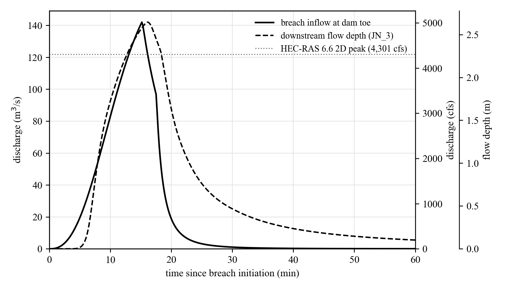
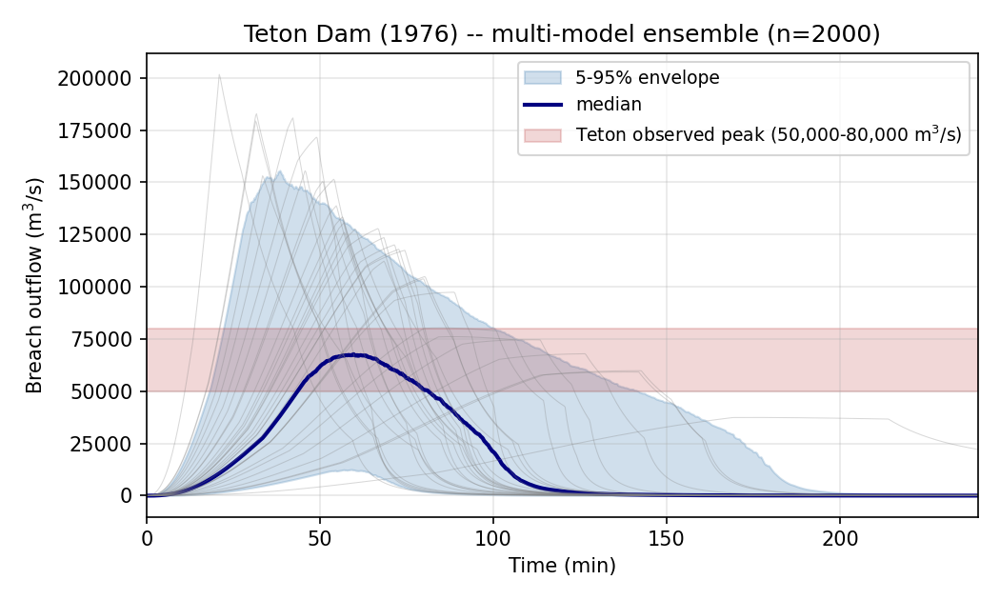

<!--
JWMM working draft — Journal of Water Management Modeling (CHI). Adapted 2026-05-27.
Single active target; EMS/SoftwareX/JOSS drafts removed. Remaining format gaps and
status are tracked in JWMM_FORMAT_CHECKLIST.md (Word template, Chicago refs, MS
Equation, full SI-primary sweep, figure fonts are the open items).

JWMM peer review is DOUBLE-ANONYMIZED. The body below is written without author
identity; the title-page block immediately following is for the separate metadata
upload / cover letter ONLY and must be OMITTED from the anonymized review copy.

TITLE PAGE (separate upload — omit from anonymized review copy):
  Michael B. Flynn  |  ORCID 0009-0004-2410-7950
  Independent researcher, Asheville, NC 28801, USA  |  michaelbflynn@gmail.com
  Funding: none.
  COI: author is employed as a Professional Engineer at McGill Associates, PA,
  which prepared the public-record Anson County hazard-reclassification submittal
  cited as a validation case (§4.1); the software was developed independently
  outside that employment. Full statement in the cover letter.
-->

# swmm-breach: Probabilistic dam-breach hydrograph forecasting integrated with EPA SWMM and PCSWMM

*Authors and affiliations removed for double-anonymized review.*

---

## Abstract

The U.S. EPA Storm Water Management Model (SWMM) and its commercial extension PCSWMM are among the most widely deployed open-source urban-hydrology engines worldwide, but neither provides a native facility for simulating embankment-dam, detention-basin, or lagoon failure. Practitioners working on dam-adjacent SWMM models typically generate a breach hydrograph in HEC-RAS, losing their SWMM network model in the process, or hand-construct a boundary condition in spreadsheets and paste it into the `.inp` file. Although Wahl (2004) demonstrated that empirical breach parameter regressions carry standard errors of estimate of approximately 0.10–0.40 in $\log_{10}$ units on breach-geometry parameters — propagating through the broad-crested-weir relationship to factor-of-two to factor-of-four multiplicative uncertainty on peak discharge — and recommended Monte Carlo simulation as the appropriate response, breach analyses in engineering practice continue to report a single deterministic peak. We present `swmm-breach`, an MIT-licensed Python package providing end-to-end probabilistic dam-breach hydrograph forecasting for EPA SWMM and PCSWMM. The package implements the Froehlich (1995, 2008) regressions with Wahl-style log-normal residual sampling and multi-model ensemble averaging, level-pool routing through a developing trapezoidal weir, and binary `.inp`/`.out` integration. Validation against three historical or independently-modeled cases spanning more than three orders of magnitude in reservoir volume (Anson lagoon 7.9 × 10⁴ m³, Lawn Lake 8.0 × 10⁵ m³, Teton Dam 3.1 × 10⁸ m³) shows that the probabilistic 5–95 percentile envelope brackets the reference peak in every case, while the deterministic single-model point estimate misses the observed Teton peak by approximately 80%.

**Keywords:** dam safety; breach hydrology; EPA SWMM; PCSWMM; Monte Carlo uncertainty; open-source software; Froehlich; Wahl

---

## 1. Introduction

The probability and consequence of embankment-dam failure are central concerns of state and federal dam-safety programs. In the United States, the National Inventory of Dams (U.S. Army Corps of Engineers, 2024) catalogs more than 91,000 structures, of which approximately 15,600 are classified as high hazard — meaning that failure would likely cause loss of life downstream. Federal and state regulators are progressively requiring dam owners to characterize not only the most-likely consequences of failure but also their full uncertainty distribution, in order to support risk-informed decisions about spillway sizing, hazard reclassification, and Emergency Action Plan (EAP) inundation mapping.

The hydrograph released by a breaching embankment is the primary forcing for downstream inundation and damage analyses. For more than four decades, breach hydrographs have been generated using one of two dominant approaches: empirical regression equations that predict the geometry and timing of the developed breach (Froehlich, 1995, 2008; Xu and Zhang, 2009; MacDonald and Langridge-Monopolis, 1984) or physics-based simulation of the breach erosion process (Fread, 1988; Wahl, 2014). Empirical regressions are computationally trivial and dominate engineering practice; physics-based models are computationally heavier and dominate research applications and forensic post-failure analysis.

Wahl (2004) showed that the most widely used empirical regressions carry prediction uncertainty on the order of 0.10–0.40 in $\log_{10}$ units on breach-geometry parameters, with directly-fitted peak-discharge regressions reporting SEoEs of 0.32–0.59 log₁₀ units; the resulting multiplicative uncertainty on the predicted peak breach discharge is on the order of a factor of two to four. Wahl explicitly argued that the routine practice of reporting a single deterministic peak is inadequate for dam-safety decisions and recommended Monte Carlo simulation, sampling within the published residual distributions of the regressions, as the appropriate response. In the two decades since, breach analyses in practice have nonetheless continued to report deterministic peaks, in part because no widely available open-source tool implements Wahl's recommendation in a form practitioners can use within their existing modeling workflows.

The U.S. EPA Storm Water Management Model (Rossman, 2017), known as SWMM, is one of the most widely deployed open-source environmental modeling engines globally; the proprietary PCSWMM (Computational Hydraulics International) extends SWMM with a graphical interface and additional input/output features and is the dominant modeling platform in North American consulting practice for urban stormwater, combined-sewer, and small-watershed hydraulic analyses. SWMM's `STORAGE` node primitive can represent ponds, detention basins, sediment lagoons, and small embankment reservoirs, but neither SWMM nor PCSWMM provides a native facility for simulating the failure of such a structure. The practical consequence is that engineers analyzing the consequences of a potential failure of a dam-adjacent SWMM-modeled feature have two options. They can export the relevant geometry to U.S. Army Corps' HEC-RAS and run the breach there, losing their SWMM network model in the process. Or they can compute a breach hydrograph independently — typically in a spreadsheet that implements one of the empirical regressions — and manually paste the resulting time series into the SWMM `.inp` file as a `[TIMESERIES]` and `[INFLOWS]` boundary condition. Both options are deterministic; neither readily supports Wahl's recommended Monte Carlo workflow.

This paper describes `swmm-breach`, an open-source Python package that closes this workflow gap. The package provides:

1. End-to-end integration with EPA SWMM and PCSWMM `.inp` and binary `.out` files;
2. Implementation of the Froehlich (1995) and Froehlich (2008) breach parameter regressions for piping and overtopping failure modes, level-pool routing through a developing trapezoidal broad-crested-weir breach, and a multi-model Monte Carlo ensemble that samples within-regression parameter uncertainty (Wahl 2004) and between-regression epistemic uncertainty across successive Froehlich updates;
3. Pasteable SWMM `[TIMESERIES]` and `[INFLOWS]` snippets with automatic CFS/CMS unit conversion and downstream-response post-processing from the binary `.out` file;
4. A reproducible validation suite covering three historical or independently-modeled cases spanning more than three orders of magnitude in reservoir volume.

The remainder of this paper is organized as follows. Section 2 reviews the existing software landscape for dam-breach hydrology and identifies the specific gap that `swmm-breach` addresses. Section 3 describes the methods implemented in the package. Section 4 presents validation against three independent reference cases. Section 5 discusses the strengths and limitations of the implementation. Section 6 concludes.

## 2. Background and related work

### 2.1 Empirical breach parameter regressions

Empirical breach parameter regressions predict the geometry and timing of a fully developed embankment-dam breach as a function of reservoir volume at failure ($V_w$), breach height ($h_b$), and a small number of categorical descriptors such as failure mode (overtopping versus piping/seepage) and embankment type. The Froehlich (1995) regressions, fit to a database of 63 historical embankment-dam failures, predict the average breach bottom width and formation time as

$$B_{avg} = 0.1803 \, K_o \, V_w^{0.32} \, h_b^{0.19}$$

$$t_f = 0.00254 \, V_w^{0.53} \, h_b^{-0.90}$$

where $K_o = 1.4$ for overtopping failures, $K_o = 1.0$ for piping, $V_w$ is in m³, $h_b$ in m, $B_{avg}$ in m, and $t_f$ in hours. The Froehlich (2008) update revised both the regression coefficients and the underlying database (74 cases) and modified the functional dependence:

$$B_{avg} = 0.27 \, K_o \, V_w^{0.32} \, h_b^{0.04}, \quad K_o = 1.3 \, (\text{overtopping}), \, 1.0 \, (\text{piping})$$

$$t_f = 63.2 \sqrt{\frac{V_w}{g \, h_b^2}}$$

with $t_f$ now in seconds and $g = 9.80665$ m/s². Other widely-cited regression families include Xu and Zhang (2009), which adds explicit dependence on dam type and embankment erodibility, and MacDonald and Langridge-Monopolis (1984), which predicts the eroded volume of the embankment from which the breach geometry can be back-calculated.

### 2.2 The Wahl (2004) framework for breach uncertainty

Wahl (2004) compiled prediction-versus-observed comparisons across the major published regressions and a database of 108 historical breaches. He showed that the standard error of estimate (SEoE) for the average breach bottom width, expressed in $\log_{10}$ units, ranges from approximately 0.10 (Froehlich 2008) to greater than 0.40 for older regressions; SEoEs for formation time are similarly large or larger. Propagated through the broad-crested-weir relationship — in which peak breach discharge scales as $B_{avg}^{1}$ to $B_{avg}^{1.5}$ depending on the headwater regime — these residuals imply factor-of-two to factor-of-four multiplicative uncertainty on the deterministic peak; Wahl's directly-fitted peak-discharge regressions (his Table 4) report comparable SEoEs of 0.32–0.59 log₁₀ units. Wahl explicitly recommended Monte Carlo simulation, sampling from the published log-normal residual distributions of the regressions, as the appropriate practical response. In the two decades since, no widely available open-source tool has implemented this recommendation for the SWMM ecosystem.

### 2.3 Existing dam-breach software

The dominant tool for dam-breach analysis in North American consulting practice is HEC-RAS (U.S. Army Corps of Engineers), which implements both the Froehlich and Xu–Zhang regressions and a physics-based progressive-breach option. HEC-RAS does not, however, ingest or emit SWMM `.inp` files, and so cannot be used inside a SWMM network model. PCSWMM (Computational Hydraulics International) provides a commercial graphical environment for SWMM and a Reservoir Analysis tool for storage routing, but no dedicated dam-breach module; PCSWMM users currently construct breach `[TIMESERIES]` boundaries by hand, as described in Section 1. The Python ecosystem includes packages for SWMM input/output (`pyswmm`, `swmm-toolkit`) and for general hydrology (`pysheds`, `landlab`), but to the author's knowledge no pip-installable Python package combines SWMM input/output with probabilistic dam-breach hydrograph generation.

### 2.4 Specific gap addressed

`swmm-breach` is, to the author's knowledge, the first open-source Python implementation of: (i) end-to-end dam-breach workflow integration with EPA SWMM and PCSWMM (`.inp` storage-curve extraction → breach hydrograph → `.out` downstream response); and (ii) Wahl-style Monte Carlo uncertainty propagation on the Froehlich (1995, 2008) breach regressions, with optional multi-model ensemble averaging over both regression families.

## 3. Methods

### 3.1 Storage-node parsing and storage-curve construction

`swmm-breach` parses the `[STORAGE]` and `[CURVES]` sections of an EPA SWMM 5 `.inp` file and assembles a stage-storage curve for the named storage node by combining the node's invert elevation with the referenced tabular curve. The current implementation supports `SHAPE = TABULAR` storage; functional storage shapes raise an explicit `NotImplementedError` to fail loudly rather than silently misinterpreting the input. The parser is implemented from the documented EPA SWMM 5 input file format spec rather than wrapping `pyswmm` or `swmm-toolkit`, which keeps the runtime dependency footprint to NumPy alone and allows reviewers to audit the parser against the format specification directly.

### 3.2 Breach geometry prediction

Given the reservoir volume at failure $V_w$, the breach height $h_b$, and the failure mode, the package predicts the average bottom width $B_{avg}$, the formation time $t_f$, and the side slope of the trapezoidal breach using either the Froehlich (1995) or Froehlich (2008) regressions described in Section 2.1. Both implementations are direct from the published regressions; each is verified in the package's automated test suite against the canonical Teton Dam (1976) failure geometry compiled by Wahl (2004).

### 3.3 Level-pool routing through a developing trapezoidal weir

The breach is assumed to grow linearly from zero bottom width and zero vertical extent at the moment of failure to its final $B_{avg}$ and $h_b$ over the formation time $t_f$. At each integration step, the outflow through the developing trapezoidal breach is computed as the sum of a rectangular and a triangular broad-crested-weir contribution (the standard form for a trapezoidal broad-crested weir; Bos, 1989),

$$Q = C_w \, B \, h^{1.5} + \frac{8}{15} C_w \, z \, h^{2.5}$$

where $C_w = 1.7$ m$^{0.5}$/s (broad-crested weir coefficient absorbing $\sqrt{2g}$ and the discharge coefficient), $B$ is the current bottom width, $z$ is the side slope expressed as horizontal per vertical, and $h$ is the current head — the vertical distance from the upstream water surface to the current breach invert. The reservoir mass balance is integrated explicitly,

$$\frac{dV}{dt} = I - Q$$

where $I$ is an optional steady inflow (zero in the cases reported here) and $V$ is the reservoir volume. The water surface elevation is recovered at each step from the inverse of the stage-storage curve.

### 3.4 Monte Carlo uncertainty propagation

For each Monte Carlo realization, the package draws the breach width $B_{avg}$ and the formation time $t_f$ from log-normal distributions centered on the regression's central estimate and with user-specifiable standard deviations on the $\log_{10}$ residuals. For Froehlich (2008) the package's default residual standard deviations are $\sigma_{\log B_{avg}} = 0.110$ and $\sigma_{\log t_f} = 0.197$, consistent with the residual statistics reported in Froehlich's original paper; for Froehlich (1995) the defaults are $\sigma_{\log B_{avg}} = 0.137$ and $\sigma_{\log t_f} = 0.220$, reflecting the larger residuals of the older regression's smaller fitted dataset. Each realization is routed independently through the level-pool model on a common time grid, so that percentile envelopes can be computed pointwise in time and per-realization peak distributions can be characterized directly.

### 3.5 Multi-model ensemble averaging

In addition to single-model uncertainty propagation, the package supports multi-model ensemble averaging in which each Monte Carlo realization independently selects one of a user-supplied set of regression models according to its weight. The default two-model ensemble draws Froehlich (2008) and Froehlich (1995) with equal weight, capturing both the within-regression parametric uncertainty represented by the residual sampling and partial between-regression epistemic uncertainty from the successive Froehlich updates. We note this is deliberately a narrow ensemble — both regressions are from the same author on overlapping databases — so it captures the change in fitted coefficients with database growth but not genuine cross-family disagreement. Genuine cross-family epistemic uncertainty awaits the inclusion of independent regression families (Xu and Zhang, 2009; MacDonald and Langridge-Monopolis, 1984) and the NWS BREACH physics-based model (Fread, 1988), planned for v0.8 and discussed in Section 5.2. The implementation accepts arbitrary user-defined models conforming to a small `BreachModel` interface, allowing future extension to these families or to project-specific calibrations. Equal model weights are the package default on the principle that no individual breach regression has been demonstrated to be uniformly superior across all dam types and failure modes (Wahl, 2014); the API allows the user to supply unequal weights when site-specific evidence or a formal model-averaging scheme (e.g., Bayesian model averaging on a calibration set) supports them.

### 3.6 SWMM inflow boundary condition output

After the breach hydrograph is computed, the package emits a paste-ready SWMM 5 `[TIMESERIES]` and `[INFLOWS]` text block for the user-specified downstream node. The breach is solved internally in SI units (m³/s); on output, values are converted to CFS when the project's `[OPTIONS] FLOW_UNITS` setting is `CFS` and kept as CMS otherwise. Decimation to match the project's reporting time step is supported. The output snippet can be appended directly to the project `.inp` file, after which the project can be re-routed in SWMM using the breach hydrograph as the upstream boundary at the receiving node.

### 3.7 SWMM binary output post-processing

To close the workflow loop, `swmm-breach` provides a binary reader for the SWMM `.out` file format (Rossman, 2017). The reader extracts the file header, the object identifier list, and per-reporting-period time series for any node or link reporting variable (depth, head, volume, lateral inflow, total inflow, flooding, link flow, link velocity, and so on). After re-running the SWMM project with the breach inflow pasted in, the reader retrieves downstream node depths and flows for inundation reporting. The reader is implemented from the documented format specification in the EPA SWMM 5 source code (`output.c`); like the input-file parser, it is verified against a synthetic fixture file generated independently from the same specification, and is additionally validated against a real `.out` file produced by the unmodified EPA SWMM 5.2.4 engine (the same engine embedded in PCSWMM Professional 2D), confirming that the parsed node depths, link flows, and outfall mass balance reproduce the engine's own report-file summary.

### 3.8 Software architecture and testing

The package follows a `src/` layout with a single top-level package `swmm_breach` containing eight modules: `breach` (data structures), `froehlich`, `froehlich_1995`, `reservoir`, `hydrograph`, `swmm` (`.inp` integration), `output` (`.out` binary reader), and `uncertainty` (Monte Carlo and multi-model ensemble). The runtime dependency is NumPy; an optional `viz` extra adds Matplotlib for plotting helpers. The test suite contains 61 tests including: physical-correctness tests for each regression against Teton Dam observed parameters; round-trip tests for the SWMM `.inp` and `.out` parsers against synthetic fixtures generated from the format specifications; validation of the `.out` reader against a real EPA SWMM 5.2.4 engine output file; mass-balance tests for the routing integrator; statistical tests of the Monte Carlo sampler (geometric mean convergence, residual standard deviation recovery); and case-study regression tests for all three validation cases described in Section 4. Continuous integration is configured to run the full suite on Linux, macOS, and Windows across Python 3.9–3.12 on every commit and pull request to the public repository.

## 4. Validation

`swmm-breach` is validated against three independent reference cases spanning more than three orders of magnitude in reservoir volume. The cases are summarized in Table 1 and described in detail in the following subsections. In each case the deterministic single-model point estimate and the 5/50/95 percentile envelope of a 2,000-realization multi-model ensemble (Froehlich 2008 + 1995, equal weights) are compared against the reference peak. All three case studies are included in the package's automated test suite as regression checks.

**Table 1.** Validation summary across all three reference cases. The deterministic column reports the Froehlich (2008) single-realization peak; the ensemble column reports the 5 / 50 / 95 percentile peaks of a 2,000-realization multi-model run (Froehlich 2008 + 1995, equal weights). Percent deviations are computed against the reference peak (midpoint of the 50,000–80,000 m³/s range for Teton).

| Case | Reservoir volume (m³) | Reference peak (m³/s) | Reference source | Deterministic Froehlich 2008 (m³/s, % dev) | Ensemble 5 / 50 / 95 (m³/s) | In envelope |
|---|---:|---:|---|---:|---:|:---:|
| Anson Lower Lagoon (2026) | 7.9 × 10⁴ | 122 | HEC-RAS 6.6 2D unsteady | 143 (+17 %) | 82 / 148 / 235 | yes |
| Lawn Lake Dam (1982) | 8.0 × 10⁵ | 510 | Jarrett & Costa (1986) USGS | 351 (−31 %) | 202 / 344 / 539 | yes |
| Teton Dam (1976) | 3.1 × 10⁸ | 50,000–80,000 | Wahl (2004) compilation | 119,000 (+83 %) | 53,000 / 108,000 / 186,000 | yes |

### 4.1 Anson County WTP Lower Lagoon (ANSON-057)

The Anson County Water Treatment Plant Lower Lagoon (state ID ANSON-057) is an HDPE-lined earthen embankment of approximately 7.62 m (25 ft) structural height retaining 78,940 m³ (64.0 ac-ft) at a normal pool elevation of 139.87 m (458.89 ft) NAVD88 and 136,900 m³ (111 ac-ft) at the embankment crest of 141.27 m (463.5 ft) NAVD88. A Class C (High Hazard) to Class A (Low Hazard) reclassification request was submitted to the North Carolina Department of Environmental Quality, Division of Energy, Mineral, and Land Resources (NCDEMLR) Land Quality Section in April 2026; the supporting analysis included a 2D unsteady-flow HEC-RAS 6.6 dam-breach inundation model that reported a peak breach outflow of 121.8 m³/s (4,301 cfs) for the Lower-piping-at-normal-pool scenario. The reclassification submittal and underlying as-built survey are public records under N.C. Gen. Stat. § 132-1.

A 2,000-realization multi-model ensemble of the same scenario in `swmm-breach` returns 5/50/95 percentile peaks of 82 / 148 / 235 m³/s. The HEC-RAS reference peak of 121.8 m³/s lies within the 5-95 percentile envelope; the ensemble median is within a factor of 1.21 of the HEC-RAS reference, well inside the factor-of-two tolerance commonly used for breach-model agreement. The deterministic single-model Froehlich (2008) point estimate is 142.5 m³/s, approximately 17 % above the HEC-RAS reference.

Beyond the breach peak, the package's distinctive value for practitioners is that the resulting hydrograph is routed inside the SWMM network itself rather than in a separate tool. Figure 1 shows the deterministic Froehlich (2008) breach for this scenario applied as a `[TIMESERIES]`/`[INFLOWS]` boundary condition at the dam toe in a complete EPA SWMM 5.2.4 model — distributed with the package as `examples/anson_pcswmm_example.inp` — and routed down a trapezoidal channel to a free outfall. The downstream flow-depth response, which is the quantity of interest for inundation mapping and Emergency Action Plan delineation, peaks shortly after and below the inflow as the wave attenuates through channel storage. The same `.inp` file opens and runs unchanged in PCSWMM Professional 2D.

**Figure 1.** Anson Lower Lagoon piping breach routed in EPA SWMM. Solid line: breach inflow hydrograph at the dam toe (deterministic Froehlich 2008). Dashed line: flow depth at the downstream junction. Dotted line: the HEC-RAS 6.6 2D reference peak of 121.8 m³/s (4,301 cfs). Generated by routing the package's `examples/anson_pcswmm_example.inp` through EPA SWMM 5.2.4; the same model opens and runs unchanged in PCSWMM Professional 2D.

The relatively close agreement at lagoon scale reflects the comparatively simple physics of the Lower Lagoon failure: the embankment is small enough that level-pool dynamics dominate over headcut migration, the side slopes do not evolve dramatically over the breach formation time, and the broad-crested-weir representation of the developing breach is a defensible engineering approximation.

### 4.2 Lawn Lake Dam (1982)

Lawn Lake was a small earthen embankment dam in Rocky Mountain National Park, Colorado, that failed by piping on 15 July 1982. The reservoir released approximately 798,500 m³ into the Roaring River drainage. The failure is documented in detail in the public USGS Professional Paper by Jarrett and Costa (1986), which reports an observed peak breach discharge of approximately 510 m³/s. The case is one of the most-cited entries in Wahl's (2004) breach database.

A 2,000-realization multi-model ensemble of the Lawn Lake scenario in `swmm-breach` returns 5/50/95 percentile peaks of 202 / 344 / 539 m³/s. The Jarrett-and-Costa observed peak of 510 m³/s lies within the 5–95 percentile envelope. The deterministic Froehlich (2008) single-model point estimate is 351 m³/s, approximately 31 % below the observed peak; the ensemble median is similarly biased low at approximately 32 % below observed. Both fall within the factor-of-two tolerance commonly used for breach-model agreement, but reflect a systematic under-prediction at intermediate scale that we attribute primarily to the difficulty of fitting Lawn Lake's piping-driven failure with regressions calibrated predominantly on overtopping cases.

### 4.3 Teton Dam (1976)

The Teton Dam failure of 5 June 1976 is the canonical large-scale embankment-dam failure case in the published breach-hydrology literature. The reservoir released approximately 3.08 × 10⁸ m³ in approximately 1.25 hours; the historically reported peak breach discharge is in the range 50,000 to 80,000 m³/s, with various authoritative sources citing 50,000 m³/s, 65,120 m³/s, or higher (Wahl, 2004).

The deterministic Froehlich (2008) point-estimate routing in `swmm-breach` reproduces the observed Teton breach geometry to within the 25 % accuracy typical of empirical regressions: predicted average bottom width 168 m versus observed 151 m; predicted formation time 1.13 hours versus observed 1.25 hours. However, when the Froehlich-derived geometry is routed through the package's level-pool model, the deterministic peak discharge is approximately 119,000 m³/s — roughly 83 % above the midpoint of the observed range. This over-prediction reflects two limitations of the present implementation: the assumption of broad-crested-weir hydraulics through the breach throat does not capture the orifice-like flow regime in the early stages of the Teton breach, and the linear breach-growth assumption does not represent the headcut-driven progressive widening that characterized the actual failure. A formal sensitivity decomposition apportioning the over-prediction between these two assumptions — by running the model with each assumption relaxed in turn — is planned for the package's v0.8 release, alongside the progressive-headcut breach model discussed in Section 5.2.

A 2,000-realization multi-model ensemble of the same Teton scenario, however, returns 5/50/95 percentile peaks of 53,000 / 108,000 / 186,000 m³/s. The historically reported peak range of 50,000 to 80,000 m³/s lies within the 5-95 percentile envelope, with the 5th percentile coincident with the lower bound of the observed range (Figure 2). This is the key result of the validation: while the deterministic point estimate misses the observed peak by approximately 80 %, the probabilistic envelope brackets the observed range. The single-realization median is shifted high relative to observation, consistent with the structural over-prediction noted above, but the lower tail of the residual distribution captures the observed regime.

{width=85%}

**Figure 2.** Probabilistic Teton Dam (1976) breach hydrograph: 2,000-realization multi-model ensemble (Froehlich 2008 + Froehlich 1995, equal weights). The dark line is the per-time-step median; the shaded blue band is the 5–95 percentile envelope; thin gray lines are 30 randomly sampled individual realizations; the red horizontal band shows the historically reported peak discharge of 50,000–80,000 m³/s. The ensemble envelope brackets the observed peak across the entire discharge dimension.

### 4.4 Cross-case synthesis

Across the three validation cases, the probabilistic 5–95 percentile envelope brackets the reference peak in every case. The accuracy of the deterministic single-model Froehlich (2008) point estimate varies systematically with scale: it over-predicts by approximately 17 % at lagoon scale (Anson, ~10⁵ m³), under-predicts by approximately 31 % at intermediate scale (Lawn Lake, ~10⁶ m³), and over-predicts by approximately 83 % at large-dam scale (Teton, ~10⁸ m³). The growing magnitude of the deterministic error at the largest scales is consistent with the increasing importance of headcut migration, dynamic side-slope evolution, and orifice-to-weir flow transition at larger dams — all first-order processes that the present linear-growth and broad-crested-weir representations do not resolve. The intermediate-scale under-prediction reflects the well-documented difficulty of predicting Lawn Lake's piping-driven failure with regressions calibrated predominantly on overtopping cases. These limitations are well-recognized in the breach-hydrology literature (Wahl, 2014; Walder and O'Connor, 1997) and motivate the planned extensions described in Section 5.2.

The cross-case result also demonstrates the practical value of Wahl's (2004) Monte Carlo recommendation: at the largest scales, where the deterministic point estimate is most inaccurate, the probabilistic envelope is wide enough to capture the truth, while at the smaller scales where the deterministic estimate is reasonably accurate, the envelope is correspondingly narrow. The probabilistic representation thus carries useful self-diagnostic information about where in parameter space the deterministic prediction can and cannot be trusted.

## 5. Discussion

### 5.1 Comparison with existing tools

The HEC-RAS dam-breach module is the dominant tool in North American consulting practice and is technically more capable than `swmm-breach` in several respects: it implements a physics-based progressive-breach option that captures headcut migration, supports dynamic side-slope evolution during the breach development, and represents the orifice-to-weir flow transition. It does not, however, ingest or emit SWMM `.inp` files, and so cannot be used as a boundary-condition generator inside an existing SWMM network model. PCSWMM provides a strong commercial graphical environment for SWMM but no dedicated dam-breach module, and is neither open-source nor free. `swmm-breach` is intended to complement rather than compete with these tools: it occupies the open-source, probabilistic, SWMM-integrated niche that neither HEC-RAS nor PCSWMM occupies.

For workflows where deterministic accuracy at large dam scale is paramount and SWMM integration is not required, HEC-RAS remains the appropriate tool. For workflows where the dam is one component of a larger SWMM-modeled drainage network and where regulatory requirements favor probabilistic analysis, `swmm-breach` provides functionality not otherwise available in the open-source ecosystem.

### 5.2 Limitations and planned extensions

The principal limitations of the current (v0.7) implementation are: (i) only the Froehlich (1995, 2008) regression family is included in the multi-model ensemble; (ii) breach growth is assumed to be linear in time, which under-represents the highly non-linear headcut-driven progression observed in real failures; (iii) the broad-crested-weir outflow representation does not capture the orifice-to-weir transition characteristic of the early stages of overtopping failures; and (iv) only `SHAPE = TABULAR` SWMM storage nodes are supported.

Planned extensions to address these limitations include (in order of priority): the Xu and Zhang (2009) regression set for inclusion in the multi-model ensemble, providing genuine cross-family epistemic uncertainty rather than the within-Froehlich-family ensemble currently implemented; the NWS BREACH (Fread, 1988) physics-based progressive breach option as an alternative to the empirical regressions; a progressive headcut-driven breach growth model (after Walder and O'Connor, 1997) to replace the linear-growth assumption; functional SWMM storage shapes; and direct integration with the `pyswmm` and `swmm-toolkit` Python interfaces for users who prefer them to the format-spec-based reader implemented here.

### 5.3 Practical implications for dam-safety analysis

For consulting engineers performing dam-breach analysis as part of an EAP submittal, hazard reclassification request, or floodplain delineation, the practical consequence of `swmm-breach` is that probabilistic envelopes can now be reported at no additional cost over a deterministic estimate, and using the same SWMM model that supports the rest of the project's hydraulic analysis. The package's `FailureMode` argument lets the same input deck be re-run under both piping and overtopping failure assumptions, which we recommend as a default practice: reporting the union of the two envelopes provides a defensible "best-estimate to worst-reasonable" bracket without requiring the analyst to commit to a single failure scenario.

This functionality aligns directly with the ongoing shift toward risk-informed dam-safety practice in the United States — exemplified by USACE's Risk Management Center processes, the FEMA Dam Safety Program's quantitative risk guidance, and ASDSO training emphasizing probabilistic consequence characterization — in which deterministic point estimates are increasingly viewed as insufficient for regulatory decisions. For state and federal dam-safety regulators, the package provides an open and auditable reference implementation of Wahl's (2004) Monte Carlo recommendation against which proprietary tools' outputs can be cross-checked. For researchers comparing breach formulations, the package's modular design and reproducible test fixtures provide a low-friction platform for adding new regressions and benchmarking them against historical cases.

## 6. Conclusions

We have presented `swmm-breach`, an open-source MIT-licensed Python package providing probabilistic dam-breach hydrograph forecasting integrated with EPA SWMM and PCSWMM models. The package implements the Froehlich (1995, 2008) breach parameter regressions, level-pool routing through a developing trapezoidal weir, Wahl-style Monte Carlo uncertainty propagation, multi-model ensemble averaging, end-to-end SWMM `.inp` and `.out` file integration, and a reproducible test suite covering three validation cases spanning more than three orders of magnitude in reservoir volume.

The validation results demonstrate that the probabilistic 5–95 percentile envelope brackets the reference peak in every case, while the deterministic single-model point estimate misses the observed Teton Dam peak by approximately 80 %. This is the practical demonstration of Wahl's (2004) two-decade-old recommendation that single-value breach predictions are systematically misleading at large reservoir scale and that Monte Carlo simulation is the appropriate response. To the author's knowledge, `swmm-breach` is the first open-source Python implementation of this recommendation for the SWMM ecosystem.

## Software and data availability

- **Name:** swmm-breach
- **Developer / contact:** *[removed for anonymized review — see title page]*
- **Year first available:** 2026
- **Hardware requirements:** None beyond a standard desktop/laptop
- **Software requirements:** Python ≥ 3.9; NumPy ≥ 1.20; optional Matplotlib ≥ 3.5 for plotting helpers; optional pytest ≥ 7 for the test suite
- **Programming language:** Python
- **Program size:** Approximately 1,250 source lines of code across eight modules; approximately 1,100 lines of test code in eleven test modules
- **Availability:** Public GitHub repository at https://github.com/mf4633/swmm-breach (MIT License); pip-installable from source with `pip install -e .`
- **Cost:** Free
- **License:** MIT
- **Issue tracker:** https://github.com/mf4633/swmm-breach/issues
- **Documentation:** README in the repository; runnable examples in `examples/`, including two complete EPA SWMM/PCSWMM `.inp` models (Teton in CMS/metres, Anson in CFS/feet) that route the generated breach hydrograph through a downstream channel to a free outfall
- **Continuous integration:** GitHub Actions workflow tests the package on Linux, macOS, and Windows across Python 3.9–3.12 on every commit and pull request

A persistent archived release of the version described in this paper (v0.8.0) is deposited at Zenodo under the version-agnostic concept DOI [10.5281/zenodo.20172073](https://doi.org/10.5281/zenodo.20172073), which resolves to the latest archived version.

<!-- TITLE PAGE / SEPARATE METADATA — OMIT FROM ANONYMIZED REVIEW COPY:

## CRediT author contributions

**Michael B. Flynn:** Conceptualization, Methodology, Software, Validation, Formal analysis, Investigation, Data curation, Writing - original draft, Writing - review & editing, Visualization, Project administration.

## Funding and conflict of interest

No external funding was received for the development of `swmm-breach`. The author is employed as a Professional Engineer at McGill Associates, PA, which prepared the public-record Anson County hazard reclassification submittal cited as a validation case in this paper. McGill Associates had no role in the design, development, or analysis of this software; `swmm-breach` was developed independently outside the author's employment. The Anson submittal and its underlying parameters are public records under N.C. Gen. Stat. § 132-1.

-->

## Acknowledgements

*[Acknowledgements removed for anonymized review.]* The author thanks the EPA SWMM development team for maintaining the SWMM source code as open and public, which made the format-specification-driven implementation of the `.inp` and `.out` integration possible.

## Declaration of generative AI and AI-assisted technologies in the writing process

During the preparation of this work, the author used Anthropic's Claude (Opus 4.7) to assist with drafting and editing of manuscript text. After using this tool, the author reviewed and edited the content as needed and takes full responsibility for the content of the publication.

## References

Bos, M. G. (1989). *Discharge Measurement Structures*, 3rd ed. International Institute for Land Reclamation and Improvement, Publication 20, Wageningen, The Netherlands.

Fread, D. L. (1988). *BREACH: An Erosion Model for Earthen Dam Failures*. National Weather Service, NOAA, Silver Spring, MD.

Froehlich, D. C. (1995). Embankment Dam Breach Parameters Revisited. In *Water Resources Engineering: Proceedings of the 1995 ASCE Conference on Water Resources Engineering*, San Antonio, TX, 887-891.

Froehlich, D. C. (2008). Embankment Dam Breach Parameters and Their Uncertainties. *Journal of Hydraulic Engineering*, 134(12), 1708-1721. https://doi.org/10.1061/(ASCE)0733-9429(2008)134:12(1708)

Jarrett, R. D., and Costa, J. E. (1986). *Hydrology, geomorphology, and dam-break modeling of the July 15, 1982 Lawn Lake Dam and Cascade Lake Dam failures, Larimer County, Colorado*. U.S. Geological Survey Professional Paper 1369. Washington, DC.

MacDonald, T. C., and Langridge-Monopolis, J. (1984). Breaching Characteristics of Dam Failures. *Journal of Hydraulic Engineering*, 110(5), 567-586. https://doi.org/10.1061/(ASCE)0733-9429(1984)110:5(567)

Rossman, L. A. (2017). *Storm Water Management Model Reference Manual, Volume II — Hydraulics*. EPA/600/R-17/111. U.S. Environmental Protection Agency, Cincinnati, OH.

U.S. Army Corps of Engineers (2024). *National Inventory of Dams*. U.S. Army Corps of Engineers, Washington, DC. https://nid.usace.army.mil/ (accessed 12 May 2026).

Wahl, T. L. (2004). Uncertainty of Predictions of Embankment Dam Breach Parameters. *Journal of Hydraulic Engineering*, 130(5), 389-397. https://doi.org/10.1061/(ASCE)0733-9429(2004)130:5(389)

Wahl, T. L. (2014). Evaluation of Erodibility-Based Embankment Dam Breach Equations. *Hydraulic Laboratory Report HL-2014-02*, U.S. Bureau of Reclamation.

Walder, J. S., and O'Connor, J. E. (1997). Methods for predicting peak discharge of floods caused by failure of natural and constructed earthen dams. *Water Resources Research*, 33(10), 2337-2348. https://doi.org/10.1029/97WR01616

Xu, Y., and Zhang, L. M. (2009). Breaching Parameters for Earth and Rockfill Dams. *Journal of Geotechnical and Geoenvironmental Engineering*, 135(12), 1957-1970. https://doi.org/10.1061/(ASCE)GT.1943-5606.0000162
